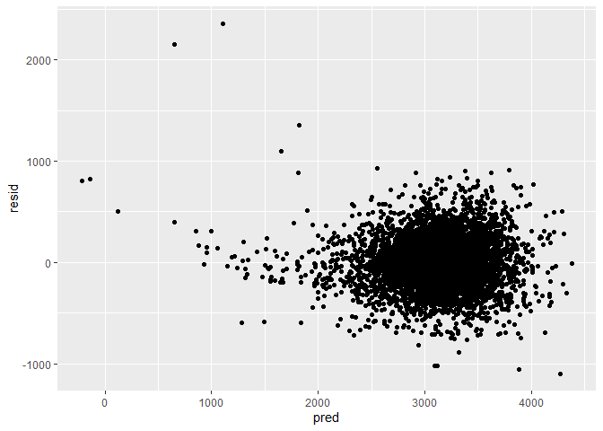
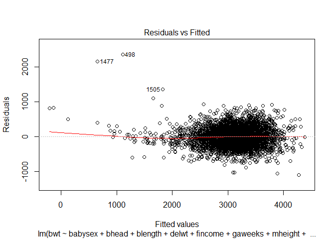
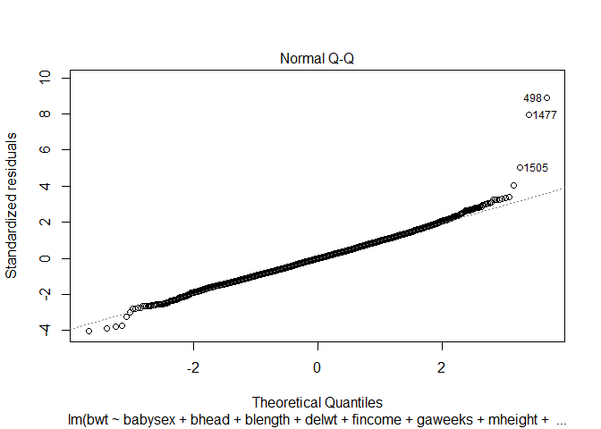
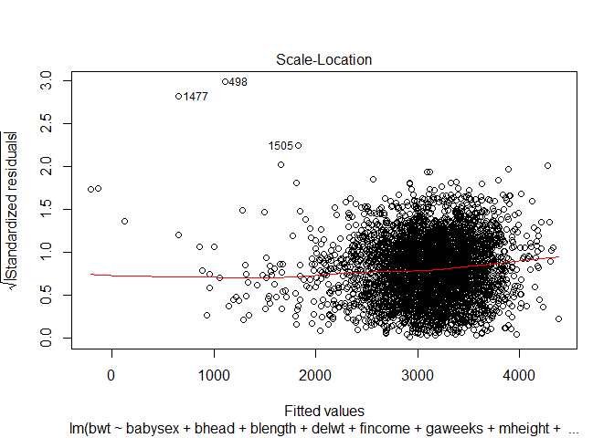
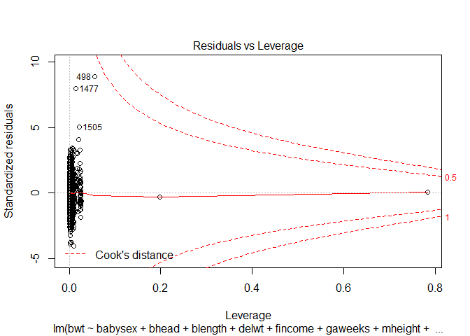
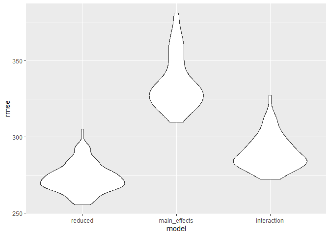
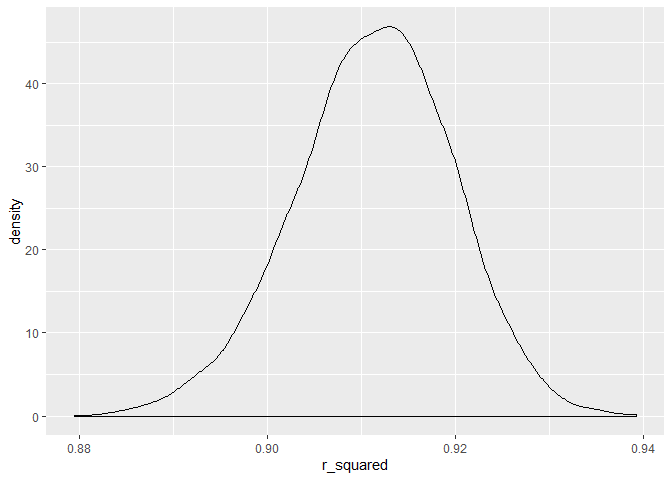
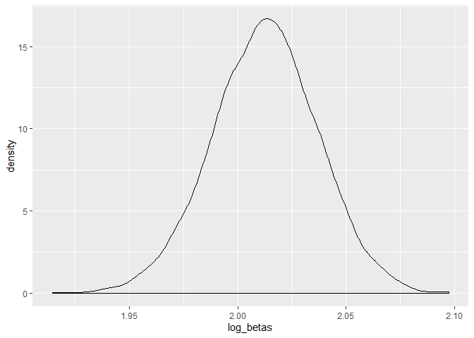

p8105\_hw6\_dd2948
================
David DeStephano
November 21, 2019

``` r
library(tidyverse)
```

    ## -- Attaching packages -------------- tidyverse 1.2.1 --

    ## v ggplot2 3.2.1     v purrr   0.3.3
    ## v tibble  2.1.3     v dplyr   0.8.3
    ## v tidyr   1.0.0     v stringr 1.4.0
    ## v readr   1.3.1     v forcats 0.4.0

    ## -- Conflicts ----------------- tidyverse_conflicts() --
    ## x dplyr::filter() masks stats::filter()
    ## x dplyr::lag()    masks stats::lag()

``` r
library(modelr)
```

Problem 1
=========

``` r
birth<-read_csv("birthweight.csv") %>% 
  mutate(babysex=factor(babysex),
         frace=factor(frace),
         malform=factor(malform),
         mrace=factor(mrace)
         ) 
```

    ## Parsed with column specification:
    ## cols(
    ##   .default = col_double()
    ## )

    ## See spec(...) for full column specifications.

``` r
#linear model for birthweight
```

Missing data?
=============

``` r
birth %>%
  map_df(~sum(is.na(.)))
```

    ## # A tibble: 1 x 20
    ##   babysex bhead blength   bwt delwt fincome frace gaweeks malform menarche
    ##     <int> <int>   <int> <int> <int>   <int> <int>   <int>   <int>    <int>
    ## 1       0     0       0     0     0       0     0       0       0        0
    ## # ... with 10 more variables: mheight <int>, momage <int>, mrace <int>,
    ## #   parity <int>, pnumlbw <int>, pnumsga <int>, ppbmi <int>, ppwt <int>,
    ## #   smoken <int>, wtgain <int>

All variables could theoretically influence the birthweight of a baby. There are no variables that stand out to me as not being a possible predictor. Therefore all variables will be included in an initial model that will then be reduced to my primary fitted model

``` r
full <- lm(bwt ~ ., data = birth)

summary(full)
```

    ## 
    ## Call:
    ## lm(formula = bwt ~ ., data = birth)
    ## 
    ## Residuals:
    ##      Min       1Q   Median       3Q      Max 
    ## -1097.68  -184.86    -3.33   173.09  2344.15 
    ## 
    ## Coefficients: (3 not defined because of singularities)
    ##               Estimate Std. Error t value Pr(>|t|)    
    ## (Intercept) -6265.3914   660.4011  -9.487  < 2e-16 ***
    ## babysex2       28.7073     8.4652   3.391 0.000702 ***
    ## bhead         130.7781     3.4523  37.881  < 2e-16 ***
    ## blength        74.9536     2.0217  37.075  < 2e-16 ***
    ## delwt           4.1007     0.3948  10.386  < 2e-16 ***
    ## fincome         0.2898     0.1795   1.614 0.106551    
    ## frace2         14.3313    46.1501   0.311 0.756168    
    ## frace3         21.2361    69.2960   0.306 0.759273    
    ## frace4        -46.9962    44.6782  -1.052 0.292912    
    ## frace8          4.2969    74.0741   0.058 0.953745    
    ## gaweeks        11.5494     1.4654   7.882 4.06e-15 ***
    ## malform1        9.7650    70.6259   0.138 0.890039    
    ## menarche       -3.5508     2.8951  -1.226 0.220083    
    ## mheight         9.7874    10.3116   0.949 0.342588    
    ## momage          0.7593     1.2221   0.621 0.534418    
    ## mrace2       -151.4354    46.0453  -3.289 0.001014 ** 
    ## mrace3        -91.3866    71.9190  -1.271 0.203908    
    ## mrace4        -56.4787    45.1369  -1.251 0.210901    
    ## parity         95.5411    40.4793   2.360 0.018307 *  
    ## pnumlbw             NA         NA      NA       NA    
    ## pnumsga             NA         NA      NA       NA    
    ## ppbmi           4.3538    14.8913   0.292 0.770017    
    ## ppwt           -3.4716     2.6121  -1.329 0.183913    
    ## smoken         -4.8544     0.5871  -8.269  < 2e-16 ***
    ## wtgain              NA         NA      NA       NA    
    ## ---
    ## Signif. codes:  0 '***' 0.001 '**' 0.01 '*' 0.05 '.' 0.1 ' ' 1
    ## 
    ## Residual standard error: 272.5 on 4320 degrees of freedom
    ## Multiple R-squared:  0.7183, Adjusted R-squared:  0.717 
    ## F-statistic: 524.6 on 21 and 4320 DF,  p-value: < 2.2e-16

``` r
#full %>% broom::tidy()
```

Since lasso is more complicated, a simple stepwise selection process will be used to make the model more parsimonious.

``` r
reduced = step(full)
```

    ## Start:  AIC=48717.83
    ## bwt ~ babysex + bhead + blength + delwt + fincome + frace + gaweeks + 
    ##     malform + menarche + mheight + momage + mrace + parity + 
    ##     pnumlbw + pnumsga + ppbmi + ppwt + smoken + wtgain
    ## 
    ## 
    ## Step:  AIC=48717.83
    ## bwt ~ babysex + bhead + blength + delwt + fincome + frace + gaweeks + 
    ##     malform + menarche + mheight + momage + mrace + parity + 
    ##     pnumlbw + pnumsga + ppbmi + ppwt + smoken
    ## 
    ## 
    ## Step:  AIC=48717.83
    ## bwt ~ babysex + bhead + blength + delwt + fincome + frace + gaweeks + 
    ##     malform + menarche + mheight + momage + mrace + parity + 
    ##     pnumlbw + ppbmi + ppwt + smoken
    ## 
    ## 
    ## Step:  AIC=48717.83
    ## bwt ~ babysex + bhead + blength + delwt + fincome + frace + gaweeks + 
    ##     malform + menarche + mheight + momage + mrace + parity + 
    ##     ppbmi + ppwt + smoken
    ## 
    ##            Df Sum of Sq       RSS   AIC
    ## - frace     4    124365 320848704 48712
    ## - malform   1      1419 320725757 48716
    ## - ppbmi     1      6346 320730684 48716
    ## - momage    1     28661 320752999 48716
    ## - mheight   1     66886 320791224 48717
    ## - menarche  1    111679 320836018 48717
    ## - ppwt      1    131132 320855470 48718
    ## <none>                  320724338 48718
    ## - fincome   1    193454 320917792 48718
    ## - parity    1    413584 321137922 48721
    ## - mrace     3    868321 321592659 48724
    ## - babysex   1    853796 321578134 48727
    ## - gaweeks   1   4611823 325336161 48778
    ## - smoken    1   5076393 325800732 48784
    ## - delwt     1   8008891 328733230 48823
    ## - blength   1 102050296 422774634 49915
    ## - bhead     1 106535716 427260054 49961
    ## 
    ## Step:  AIC=48711.51
    ## bwt ~ babysex + bhead + blength + delwt + fincome + gaweeks + 
    ##     malform + menarche + mheight + momage + mrace + parity + 
    ##     ppbmi + ppwt + smoken
    ## 
    ##            Df Sum of Sq       RSS   AIC
    ## - malform   1      1447 320850151 48710
    ## - ppbmi     1      6975 320855679 48710
    ## - momage    1     28379 320877083 48710
    ## - mheight   1     69502 320918206 48710
    ## - menarche  1    115708 320964411 48711
    ## - ppwt      1    133961 320982665 48711
    ## <none>                  320848704 48712
    ## - fincome   1    194405 321043108 48712
    ## - parity    1    414687 321263390 48715
    ## - babysex   1    852133 321700837 48721
    ## - gaweeks   1   4625208 325473911 48772
    ## - smoken    1   5036389 325885093 48777
    ## - delwt     1   8013099 328861802 48817
    ## - mrace     3  13540415 334389119 48885
    ## - blength   1 101995688 422844392 49908
    ## - bhead     1 106662962 427511666 49956
    ## 
    ## Step:  AIC=48709.53
    ## bwt ~ babysex + bhead + blength + delwt + fincome + gaweeks + 
    ##     menarche + mheight + momage + mrace + parity + ppbmi + ppwt + 
    ##     smoken
    ## 
    ##            Df Sum of Sq       RSS   AIC
    ## - ppbmi     1      6928 320857079 48708
    ## - momage    1     28660 320878811 48708
    ## - mheight   1     69320 320919470 48708
    ## - menarche  1    116027 320966177 48709
    ## - ppwt      1    133894 320984044 48709
    ## <none>                  320850151 48710
    ## - fincome   1    193784 321043934 48710
    ## - parity    1    414482 321264633 48713
    ## - babysex   1    851279 321701430 48719
    ## - gaweeks   1   4624003 325474154 48770
    ## - smoken    1   5035195 325885346 48775
    ## - delwt     1   8029079 328879230 48815
    ## - mrace     3  13553320 334403471 48883
    ## - blength   1 102009225 422859375 49906
    ## - bhead     1 106675331 427525481 49954
    ## 
    ## Step:  AIC=48707.63
    ## bwt ~ babysex + bhead + blength + delwt + fincome + gaweeks + 
    ##     menarche + mheight + momage + mrace + parity + ppwt + smoken
    ## 
    ##            Df Sum of Sq       RSS   AIC
    ## - momage    1     29211 320886290 48706
    ## - menarche  1    117635 320974714 48707
    ## <none>                  320857079 48708
    ## - fincome   1    195199 321052278 48708
    ## - parity    1    412984 321270064 48711
    ## - babysex   1    850020 321707099 48717
    ## - mheight   1   1078673 321935752 48720
    ## - ppwt      1   2934023 323791103 48745
    ## - gaweeks   1   4621504 325478583 48768
    ## - smoken    1   5039368 325896447 48773
    ## - delwt     1   8024939 328882018 48813
    ## - mrace     3  13551444 334408523 48881
    ## - blength   1 102018559 422875638 49904
    ## - bhead     1 106821342 427678421 49953
    ## 
    ## Step:  AIC=48706.02
    ## bwt ~ babysex + bhead + blength + delwt + fincome + gaweeks + 
    ##     menarche + mheight + mrace + parity + ppwt + smoken
    ## 
    ##            Df Sum of Sq       RSS   AIC
    ## - menarche  1    100121 320986412 48705
    ## <none>                  320886290 48706
    ## - fincome   1    240800 321127090 48707
    ## - parity    1    431433 321317724 48710
    ## - babysex   1    841278 321727568 48715
    ## - mheight   1   1076739 321963029 48719
    ## - ppwt      1   2913653 323799943 48743
    ## - gaweeks   1   4676469 325562760 48767
    ## - smoken    1   5045104 325931394 48772
    ## - delwt     1   8000672 328886962 48811
    ## - mrace     3  14667730 335554021 48894
    ## - blength   1 101990556 422876847 49902
    ## - bhead     1 106864308 427750598 49952
    ## 
    ## Step:  AIC=48705.38
    ## bwt ~ babysex + bhead + blength + delwt + fincome + gaweeks + 
    ##     mheight + mrace + parity + ppwt + smoken
    ## 
    ##           Df Sum of Sq       RSS   AIC
    ## <none>                 320986412 48705
    ## - fincome  1    245637 321232048 48707
    ## - parity   1    422770 321409181 48709
    ## - babysex  1    846134 321832545 48715
    ## - mheight  1   1012240 321998651 48717
    ## - ppwt     1   2907049 323893461 48743
    ## - gaweeks  1   4662501 325648912 48766
    ## - smoken   1   5073849 326060260 48771
    ## - delwt    1   8137459 329123871 48812
    ## - mrace    3  14683609 335670021 48894
    ## - blength  1 102191779 423178191 49903
    ## - bhead    1 106779754 427766166 49950

``` r
summary(reduced)
```

    ## 
    ## Call:
    ## lm(formula = bwt ~ babysex + bhead + blength + delwt + fincome + 
    ##     gaweeks + mheight + mrace + parity + ppwt + smoken, data = birth)
    ## 
    ## Residuals:
    ##      Min       1Q   Median       3Q      Max 
    ## -1097.18  -185.52    -3.39   174.14  2353.44 
    ## 
    ## Coefficients:
    ##               Estimate Std. Error t value Pr(>|t|)    
    ## (Intercept) -6098.8219   137.5463 -44.340  < 2e-16 ***
    ## babysex2       28.5580     8.4549   3.378 0.000737 ***
    ## bhead         130.7770     3.4466  37.944  < 2e-16 ***
    ## blength        74.9471     2.0190  37.120  < 2e-16 ***
    ## delwt           4.1067     0.3921  10.475  < 2e-16 ***
    ## fincome         0.3180     0.1747   1.820 0.068844 .  
    ## gaweeks        11.5925     1.4621   7.929 2.79e-15 ***
    ## mheight         6.5940     1.7849   3.694 0.000223 ***
    ## mrace2       -138.7925     9.9071 -14.009  < 2e-16 ***
    ## mrace3        -74.8868    42.3146  -1.770 0.076837 .  
    ## mrace4       -100.6781    19.3247  -5.210 1.98e-07 ***
    ## parity         96.3047    40.3362   2.388 0.017004 *  
    ## ppwt           -2.6756     0.4274  -6.261 4.20e-10 ***
    ## smoken         -4.8434     0.5856  -8.271  < 2e-16 ***
    ## ---
    ## Signif. codes:  0 '***' 0.001 '**' 0.01 '*' 0.05 '.' 0.1 ' ' 1
    ## 
    ## Residual standard error: 272.3 on 4328 degrees of freedom
    ## Multiple R-squared:  0.7181, Adjusted R-squared:  0.7173 
    ## F-statistic: 848.1 on 13 and 4328 DF,  p-value: < 2.2e-16

``` r
reduced %>% 
  broom::tidy() %>% 
  knitr::kable(digits = 3)
```

| term        |   estimate|  std.error|  statistic|  p.value|
|:------------|----------:|----------:|----------:|--------:|
| (Intercept) |  -6098.822|    137.546|    -44.340|    0.000|
| babysex2    |     28.558|      8.455|      3.378|    0.001|
| bhead       |    130.777|      3.447|     37.944|    0.000|
| blength     |     74.947|      2.019|     37.120|    0.000|
| delwt       |      4.107|      0.392|     10.475|    0.000|
| fincome     |      0.318|      0.175|      1.820|    0.069|
| gaweeks     |     11.592|      1.462|      7.929|    0.000|
| mheight     |      6.594|      1.785|      3.694|    0.000|
| mrace2      |   -138.792|      9.907|    -14.009|    0.000|
| mrace3      |    -74.887|     42.315|     -1.770|    0.077|
| mrace4      |   -100.678|     19.325|     -5.210|    0.000|
| parity      |     96.305|     40.336|      2.388|    0.017|
| ppwt        |     -2.676|      0.427|     -6.261|    0.000|
| smoken      |     -4.843|      0.586|     -8.271|    0.000|

Describe your modeling process and show a plot of model residuals against fitted values – use add\_predictions and add\_residuals in making this plot.
======================================================================================================================================================

``` r
birth %>% 
  modelr::add_residuals(reduced) %>% 
  modelr::add_predictions(reduced) %>% 
  ggplot(aes(x = pred, y = resid)) + geom_point()
```



``` r
plot(reduced)
```



Model comparisons
=================

The reduced fit model will be compared to two alternative models:

#### main\_effects\_fit: Length at birth and GA

``` r
main_effects_fit<-lm(bwt ~ blength + gaweeks, data = birth)

main_effects_fit %>% 
  broom::tidy() %>% 
  knitr::kable(digits = 3)
```

| term        |   estimate|  std.error|  statistic|  p.value|
|:------------|----------:|----------:|----------:|--------:|
| (Intercept) |  -4347.667|     97.958|    -44.383|        0|
| blength     |    128.556|      1.990|     64.604|        0|
| gaweeks     |     27.047|      1.718|     15.744|        0|

#### interaction\_fit: head circumference, length at birth, sex, and all interacting terms

``` r
interaction_fit<-lm(bwt ~ bhead + blength + babysex + bhead*blength +bhead*babysex + blength*babysex + bhead*blength*babysex, data = birth)

interaction_fit %>% 
  broom::tidy() %>% 
  knitr::kable(digits = 3)
```

| term                   |   estimate|  std.error|  statistic|  p.value|
|:-----------------------|----------:|----------:|----------:|--------:|
| (Intercept)            |  -7176.817|   1264.840|     -5.674|    0.000|
| bhead                  |    181.796|     38.054|      4.777|    0.000|
| blength                |    102.127|     26.212|      3.896|    0.000|
| babysex2               |   6374.868|   1677.767|      3.800|    0.000|
| bhead:blength          |     -0.554|      0.780|     -0.710|    0.478|
| bhead:babysex2         |   -198.393|     51.092|     -3.883|    0.000|
| blength:babysex2       |   -123.773|     35.119|     -3.524|    0.000|
| bhead:blength:babysex2 |      3.878|      1.057|      3.670|    0.000|

### Compared the models in terms of the cross-validated prediction error; use crossv\_mc and functions in purrr as appropriate.

``` r
cv_df =
  crossv_mc(birth, 100) 

# cv_df =
#   cv_df %>% 
#   mutate(
#     train = map(train, as_tibble),
#     test = map(test, as_tibble))

#Fit models to training data and obtain corresponding RMSEs for the testing data.
cv_df <- cv_df %>% 
   mutate(
     reduced=map(train, ~lm(bwt ~ babysex + bhead + blength + delwt + fincome + gaweeks + mheight + mrace + parity + ppwt +smoken, data=.x)),
    main_effects = map(train, ~lm(bwt ~ blength + gaweeks, data = .x)),
    interaction = map(train, ~lm(bwt ~ bhead + blength + babysex + bhead*blength +bhead*babysex + blength*babysex + bhead*blength*babysex, data=.x))) %>% 
  mutate(rmse_reduced = map2_dbl(reduced, test, ~rmse(model = .x, data = .y)),
         rmse_main_effects    = map2_dbl(main_effects, test, ~rmse(model = .x, data = .y)),
         rmse_interaction = map2_dbl(interaction, test, ~rmse(model = .x, data = .y)))


#Finally, I’ll plot the prediction error distribution for each candidate model.
cv_df %>% 
  select(starts_with("rmse")) %>% 
pivot_longer(
    everything(),
    names_to = "model", 
    values_to = "rmse",
    names_prefix = "rmse_") %>% 
  mutate(model = fct_inorder(model)) %>% 
  ggplot(aes(x = model, y = rmse)) + geom_violin()
```



Looking at the violin plots, my model had the lowest RMSE distribution.

Problem 2
=========

``` r
weather_df = 
  rnoaa::meteo_pull_monitors(
    c("USW00094728"),
    var = c("PRCP", "TMIN", "TMAX"), 
    date_min = "2017-01-01",
    date_max = "2017-12-31") %>%
  mutate(
    name = recode(id, USW00094728 = "CentralPark_NY"),
    tmin = tmin / 10,
    tmax = tmax / 10) %>%
  select(name, id, everything())
```

    ## Registered S3 method overwritten by 'crul':
    ##   method                 from
    ##   as.character.form_file httr

    ## Registered S3 method overwritten by 'hoardr':
    ##   method           from
    ##   print.cache_info httr

    ## file path:          C:\Users\daved\AppData\Local\rnoaa\rnoaa\Cache/ghcnd/USW00094728.dly

    ## file last updated:  2019-09-26 10:26:12

    ## file min/max dates: 1869-01-01 / 2019-09-30

5000 bootstraps
---------------

### R squared

``` r
boot_straps = 
  weather_df %>% 
  modelr::bootstrap(n = 5000) %>% 
  mutate(
    models = map(strap, ~lm(tmax ~ tmin, data = .x) ),
    results = map(models, broom::glance), 
    results2 = map(models, broom::tidy))

rsq<-boot_straps %>% select(results) %>% 
  unnest(results) %>% janitor::clean_names()

#Overall Rsquare distriution
rsq %>% ggplot(aes(x=r_squared))+
  geom_density()
```



``` r
#Quantiles
quantile(rsq$r_squared, probs=c(0.025, 0.975)) %>% knitr::kable()
```

|       |          x|
|-------|----------:|
| 2.5%  |  0.8936824|
| 97.5% |  0.9270637|

The 95% CI for R^2 is (0.89, 0.93)

### log beta

``` r
log<-boot_straps %>% select(results2) %>% 
  unnest(results2) %>% 
  select(term, estimate) %>% 
  pivot_wider(
    names_from = "term",
    values_from = "estimate") %>% 
  unnest() %>% 
  janitor::clean_names() %>% 
  mutate(log_betas=log(intercept*tmin))
```

    ## Warning: Values in `estimate` are not uniquely identified; output will contain list-cols.
    ## * Use `values_fn = list(estimate = list)` to suppress this warning.
    ## * Use `values_fn = list(estimate = length)` to identify where the duplicates arise
    ## * Use `values_fn = list(estimate = summary_fun)` to summarise duplicates

    ## Warning: `cols` is now required.
    ## Please use `cols = c(`(Intercept)`, tmin)`

``` r
#Overall log(β^0∗β^1) distribution
log %>% ggplot(aes(x=log_betas))+
  geom_density()
```



``` r
#Quantiles
quantile(log$log_betas, probs=c(0.025, 0.975)) %>% knitr::kable()
```

|       |         x|
|-------|---------:|
| 2.5%  |  1.963950|
| 97.5% |  2.060242|

The 95% CI for log(β<sup>0∗β</sup>1) is (1.97, 2.06)
